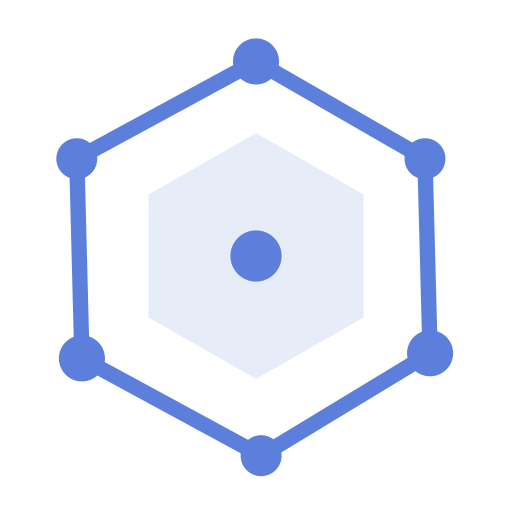

#  <span style="vertical-align: middle">Polyfence</span>

**Privacy-first, on-device geofencing for Flutter.** Accurate circle & polygon zone detection with true background operation on both platforms. No location data or PII ever transmitted. Minimal dependencies. Anonymous plugin telemetry enabled by default ([opt-out](#telemetry-opt-out)).


[](https://opensource.org/licenses/MIT)


**Three ways to use Polyfence** — choose what fits your workflow:

| Approach | Backend | API Key | Best For |
|----------|---------|---------|----------|
| **Hardcode zones in your app** | None | Not needed | Static zones, full control, privacy-first apps |
| **Fetch from your own API** | Your backend | Not needed | Existing infrastructure, custom zone logic |
| **Use Polyfence SaaS** _(optional)_ | polyfence.io | Required | Visual zone editor, analytics dashboard |

All three approaches use the **same plugin API** — switch anytime without code changes.

---

## Requirements

| Requirement | Version |
|-------------|---------|
| **Flutter** | 3.10.0+ |
| **Dart SDK** | 3.0.0+ |
| **Android** | API 21+ (Android 5.0), tested up to API 35 (Android 15) |
| **iOS** | 12.0+ |

## Platform Support

| Feature | Android | iOS |
|---------|---------|-----|
| Circle geofences | Yes | Yes |
| Polygon geofences | Yes | Yes |
| Dwell detection | Yes | Yes |
| Zone clustering | Yes | Yes |
| Scheduled tracking | Yes | Yes |
| Activity recognition | Yes | Yes |
| Background tracking | Yes (foreground service) | Yes ("Always" permission) |
| Battery optimization bypass | Yes | N/A |
| GPS accuracy profiles | Yes | Partial (iOS manages GPS) |

## Installation

```yaml
# pubspec.yaml
dependencies:
  polyfence: ^0.9.0
```

**Current version:** 0.9.0

```bash
flutter pub get
```

> **New to Polyfence?** Try the example app first: `cd example && flutter run` (works immediately, no setup needed)

## Platform Setup

### Android — `android/app/src/main/AndroidManifest.xml`

```xml
<uses-permission android:name="android.permission.ACCESS_FINE_LOCATION" />
<uses-permission android:name="android.permission.ACCESS_COARSE_LOCATION" />
<uses-permission android:name="android.permission.ACCESS_BACKGROUND_LOCATION" />
<uses-permission android:name="android.permission.FOREGROUND_SERVICE" />
<uses-permission android:name="android.permission.FOREGROUND_SERVICE_LOCATION" />
<uses-permission android:name="android.permission.WAKE_LOCK" />
<uses-permission android:name="android.permission.REQUEST_IGNORE_BATTERY_OPTIMIZATIONS" />
```

- **minSdk**: 21+ (Android 5.0)
- **tested**: up to API 35 (Android 15)
- **dependency**: Google Play Services Location 21.0.1 (automatically included)

Ensure your `android/app/build.gradle` has the correct minimum SDK version:
```groovy
android {
    defaultConfig {
        minSdkVersion 21 // Required for Polyfence
    }
}
```

#### Foreground Service Notification

Polyfence requires a foreground service notification on Android. **The plugin automatically creates the notification channel** — no additional setup required. The notification uses low priority and is silent.

### iOS — `ios/Runner/Info.plist`

```xml
<key>NSLocationWhenInUseUsageDescription</key>
<string>This app needs location access to detect when you enter or exit defined zones.</string>

<key>NSLocationAlwaysAndWhenInUseUsageDescription</key>
<string>Background location access is required for continuous zone monitoring.</string>

<key>NSLocationAlwaysUsageDescription</key>
<string>Background location access is required for continuous zone monitoring.</string>

<key>UIBackgroundModes</key>
<array>
  <string>location</string>
</array>
```

- **iOS**: 12.0+
- **Requires** "Always" location for background geofencing

#### iOS Background Mode in Xcode

1. Open `ios/Runner.xcworkspace` in Xcode
2. Select the Runner target → **Signing & Capabilities**
3. Click **+ Capability** → add **Background Modes**
4. Check **Location updates**

#### iOS Permission Flow

**Important:** iOS requires "Always" location permission for background geofencing, but the flow is different from Android:

1. **First Request:** When you call `requestPermissions(always: true)`, iOS shows a "While in use" permission dialog
2. **Manual Step Required:** The user must manually enable "Always" permission in Settings → Privacy & Security → Location Services → Your App → "Always"
3. **Check Permission Status:**

```dart
final isEnabled = await Polyfence.instance.isLocationServiceEnabled();
if (!isEnabled) {
  // Guide user to enable location services
}

final granted = await Polyfence.instance.requestPermissions(always: true);
if (granted) {
  // User granted "While in use" — they still need to enable "Always" in Settings
  // You may want to show a dialog guiding them to Settings
}
```

**Note:** iOS doesn't provide a direct API to check if "Always" permission is granted. The plugin will work with "While in use" but background geofencing requires "Always" permission.

## Getting Started

### Step 1: Initialize the Plugin

```dart
import 'package:polyfence/polyfence.dart';

await Polyfence.instance.initialize();
```

### Step 2: Request Permissions

```dart
final hasPermission = await Polyfence.instance.requestPermissions(always: true);
if (!hasPermission) {
  // Handle permission denied
  return;
}
```

### Step 3: Add Zones

```dart
// Circle zone
await Polyfence.instance.addZone(Zone.circle(
  id: 'office',
  name: 'Office',
  center: PolyfenceLocation(latitude: 37.422, longitude: -122.084),
  radius: 150,
));

// Polygon zone
await Polyfence.instance.addZone(Zone.polygon(
  id: 'campus',
  name: 'Campus',
  polygon: [
    PolyfenceLocation(latitude: 37.422, longitude: -122.084),
    PolyfenceLocation(latitude: 37.423, longitude: -122.085),
    PolyfenceLocation(latitude: 37.424, longitude: -122.083),
  ],
));
```

Zones are automatically persisted across app restarts — no database setup needed. There is no hard limit on zone count (tested with 100+ zones on both platforms). Large polygons (1000+ points) are supported; the plugin uses Douglas-Peucker simplification to optimize complex polygons. Unlike plugins that rely on the OS native region monitoring APIs, Polyfence performs its own on-device calculations — so the iOS 20-region limit does not apply.

### Step 4: Listen for Events

```dart
Polyfence.instance.onGeofenceEvent.listen((event) {
  switch (event.type) {
    case GeofenceEventType.enter:
      print('Entered: ${event.zoneId}');
      break;
    case GeofenceEventType.exit:
      print('Exited: ${event.zoneId}');
      break;
    case GeofenceEventType.dwell:
      print('Stayed in ${event.zoneId} for 5+ minutes');
      break;
    default:
      break;
  }
});
```

### Step 5: Start Tracking

```dart
await Polyfence.instance.startTracking();
```

### Step 6: Handle Errors (Optional)

```dart
Polyfence.instance.onError.listen((error) {
  switch (error.type) {
    case PolyfenceErrorType.gpsPermissionDenied:
      // Guide user to settings
      break;
    case PolyfenceErrorType.gpsServiceDisabled:
      // Prompt to enable GPS
      break;
    default:
      print('Error: ${error.message}');
  }
});
```


## Configuration

Polyfence provides flexible configuration to balance accuracy, battery life, and notification behavior.

### Alert Notifications

By default, Polyfence shows built-in "Entered Zone" / "Exited Zone" notifications. If your app implements custom notifications, you can disable these:

```dart
await Polyfence.instance.initialize(
  config: {
    'disableAlertNotifications': true,  // Suppress built-in zone alerts
  },
);
```

**Use cases:** custom notifications with app-specific context, apps that handle zone events silently, or different notification styles. The foreground service notification remains active (required for background GPS).

### GPS Accuracy Profiles

```dart
// Maximum accuracy (highest battery usage)
await Polyfence.instance.setAccuracyProfile(PolyfenceAccuracyProfile.maxAccuracy);

// Balanced accuracy/battery (DEFAULT - recommended for most apps)
await Polyfence.instance.setAccuracyProfile(PolyfenceAccuracyProfile.balanced);

// Battery-optimized for background monitoring
await Polyfence.instance.setAccuracyProfile(PolyfenceAccuracyProfile.batteryOptimal);

// Intelligent auto-adjustment based on context
await Polyfence.instance.setAccuracyProfile(PolyfenceAccuracyProfile.adaptive);
```

| Profile | GPS Accuracy | Update Interval | Battery Impact | Use Case |
|---------|-------------|-----------------|----------------|----------|
| **Max Accuracy** | High | 5 seconds (Android) | High | Delivery, navigation, fleet tracking |
| **Balanced** | Balanced | 10 seconds (Android) | Medium | Most location-aware apps |
| **Battery Optimal** | Low Power | 30 seconds (Android) | Low | Background monitoring, casual use |
| **Adaptive** | Dynamic | Dynamic (Android) | Variable | Apps with varying accuracy needs |

> **Platform Note:** Both platforms respect accuracy profiles. Android uses explicit update intervals; iOS uses `desiredAccuracy` and `distanceFilter` settings which CoreLocation optimizes automatically.

### Advanced Configuration

```dart
// Proximity-aware GPS optimization
await Polyfence.instance.updateConfiguration(
  PolyfenceConfiguration(
    accuracyProfile: PolyfenceAccuracyProfile.balanced,
    updateStrategy: PolyfenceUpdateStrategy.proximityBased,
    proximitySettings: ProximitySettings(
      nearZoneThresholdMeters: 500.0,
      farZoneThresholdMeters: 2000.0,
      nearZoneUpdateInterval: Duration(seconds: 5),
      farZoneUpdateInterval: Duration(seconds: 60),
    ),
  ),
);

// Movement-based optimization
await Polyfence.instance.updateConfiguration(
  PolyfenceConfiguration(
    updateStrategy: PolyfenceUpdateStrategy.movementBased,
    movementSettings: MovementSettings(
      stationaryThreshold: Duration(minutes: 5),
      stationaryUpdateInterval: Duration(minutes: 2),
      movingUpdateInterval: Duration(seconds: 10),
    ),
  ),
);

// Intelligent optimization (proximity + movement + battery)
await Polyfence.instance.enableIntelligentOptimization();
```

### GPS Accuracy Threshold

By default, Polyfence rejects GPS readings with accuracy worse than **100 meters** to ensure consistent behavior across iOS and Android. This threshold is configurable:

```dart
await Polyfence.instance.updateConfiguration(
  PolyfenceConfiguration(
    gpsAccuracyThreshold: 50.0, // 50 meters - stricter
    // Or
    gpsAccuracyThreshold: 200.0, // 200 meters - more lenient
  ),
);
```

### Proximity-Based Optimization

```dart
await Polyfence.instance.enableProximityOptimization(
  nearThreshold: 500.0,  // High accuracy within 500m of zones
  farThreshold: 2000.0,  // Low frequency when >2km from zones
);
```

**Proximity Behavior:**

- **Inside zones**: Continuous monitoring for exit detection
- **Near zones (<500m)**: High frequency for accurate entry detection
- **Medium distance (500m-2km)**: Graduated frequency based on distance
- **Far from zones (>2km)**: Low frequency monitoring to preserve battery

This can reduce GPS usage by 60-80% for users who spend time away from monitored zones.

### Dwell Detection

Dwell events fire when a device remains inside a zone for a configurable duration (default: 5 minutes). Useful for confirming presence rather than pass-through.

```dart
// Listen for dwell events
Polyfence.instance.onGeofenceEvent.listen((event) {
  if (event.type == GeofenceEventType.dwell) {
    print('User confirmed in ${event.zoneId}');
  }
});

// Configure threshold (default: 5 minutes)
await Polyfence.instance.updateConfiguration(
  PolyfenceConfiguration(
    dwellSettings: DwellSettings(
      enabled: true,
      dwellThreshold: Duration(minutes: 10),
    ),
  ),
);
```

| Setting | Default | Description |
|---------|---------|-------------|
| `enabled` | `true` | Whether dwell detection is active |
| `dwellThreshold` | 5 minutes | Time inside zone before DWELL fires |

### Zone Clustering

For apps with large zone sets (100+ zones), clustering improves performance by only checking zones near the user's location.

```dart
await Polyfence.instance.updateConfiguration(
  PolyfenceConfiguration(
    clusterSettings: ClusterSettings(
      enabled: true,
      activeRadiusMeters: 5000,    // Check zones within 5km
      refreshDistanceMeters: 1000, // Re-evaluate cluster after moving 1km
    ),
  ),
);
```

| Setting | Default | Description |
|---------|---------|-------------|
| `enabled` | `false` | Whether clustering is active |
| `activeRadiusMeters` | 5000 | Radius to check zones within |
| `refreshDistanceMeters` | 1000 | Distance to move before refreshing active cluster |

**When to use:** Apps with 100+ geographically distributed zones (retail chains, delivery networks). For apps with fewer zones, clustering adds overhead without benefit.

### Scheduled Tracking

Automatically start and stop tracking based on time windows. Useful for work-hours-only tracking, shift-based applications, or battery conservation.

```dart
// Track only during work hours (9am-5pm, weekdays)
await Polyfence.instance.updateConfiguration(
  PolyfenceConfiguration(
    scheduleSettings: ScheduleSettings(
      enabled: true,
      timeWindows: [
        TimeWindow(
          startTime: TimeOfDay(hour: 9, minute: 0),
          endTime: TimeOfDay(hour: 17, minute: 0),
          daysOfWeek: [1, 2, 3, 4, 5], // Monday-Friday
        ),
      ],
    ),
  ),
);
```

| Setting | Default | Description |
|---------|---------|-------------|
| `enabled` | `false` | Whether scheduled tracking is active |
| `timeWindows` | `[]` | List of time windows when tracking is active |
| `startImmediatelyIfInWindow` | `true` | Start tracking immediately if currently in a scheduled window |

**TimeWindow properties:**

| Property | Description |
|----------|-------------|
| `startTime` | When tracking should start (TimeOfDay with hour/minute) |
| `endTime` | When tracking should stop (TimeOfDay with hour/minute) |
| `daysOfWeek` | Days when window applies (1=Monday, 7=Sunday). Empty = all days |

**Notes:** Schedule persists across app restarts and device reboots. Time windows that span midnight are supported (e.g., 22:00 - 06:00). Multiple overlapping windows are supported — tracking is active during any of them. On Android, uses AlarmManager for reliable wake-up at scheduled times.

### Activity Recognition

Automatically detect user activity (still, walking, running, cycling, driving) and optimize GPS intervals accordingly. This feature is **opt-in** and requires additional permissions.

```dart
// Enable activity recognition
await Polyfence.instance.updateConfiguration(
  PolyfenceConfiguration(
    activitySettings: ActivitySettings(
      enabled: true,
      confidenceThreshold: 75,   // Only act on 75%+ confidence
      debounceSeconds: 30,       // Wait 30s before switching modes
    ),
  ),
);

// Custom intervals per activity (optional)
await Polyfence.instance.updateConfiguration(
  PolyfenceConfiguration(
    activitySettings: ActivitySettings(
      enabled: true,
      stillInterval: Duration(seconds: 120),    // 2 min when stationary
      walkingInterval: Duration(seconds: 15),   // 15s when walking
      drivingInterval: Duration(seconds: 5),    // 5s when driving
    ),
  ),
);
```

| Setting | Default | Description |
|---------|---------|-------------|
| `enabled` | `false` | Whether activity recognition is active (opt-in) |
| `confidenceThreshold` | `75` | Minimum confidence (0-100) before acting on detected activity |
| `debounceSeconds` | `30` | Seconds activity must persist before switching GPS mode |
| `stillInterval` | 120s | GPS interval when device is stationary |
| `walkingInterval` | 15s | GPS interval when walking |
| `runningInterval` | 10s | GPS interval when running |
| `cyclingInterval` | 8s | GPS interval when cycling |
| `drivingInterval` | 5s | GPS interval when driving |

**Platform APIs:** Android uses `ActivityRecognitionClient` from Google Play Services. iOS uses `CMMotionActivityManager` from CoreMotion.

**Additional Permissions Required:**

**Android** — Add to `AndroidManifest.xml` (only if using activity recognition):
```xml
<uses-permission android:name="android.permission.ACTIVITY_RECOGNITION" />
```

**iOS** — Add to `Info.plist` (only if using activity recognition):
```xml
<key>NSMotionUsageDescription</key>
<string>This app uses motion data to optimize GPS updates based on your activity.</string>
```

**Important:** Activity recognition only affects GPS update intervals. It does NOT affect zone detection accuracy, validation logic, or confidence thresholds. When near a zone, proximity-based fast updates take precedence over activity-based optimizations.

## Background Reliability & Battery Optimization

### Battery-Saving Features (v0.8.0+)

Polyfence includes comprehensive battery optimizations that reduce drain by an estimated 40-50%:

| Feature | Description | Platforms |
|---------|-------------|-----------|
| **Deferred GPS Start** | GPS doesn't start until zones are registered | Android & iOS |
| **Distance Filter** | Only receive updates when device moves (10m for BALANCED profile) | Android & iOS |
| **Zone Check Throttling** | Skip geofence checks if moved <5 meters | Android & iOS |
| **Callback Throttling** | Reduce Flutter callbacks to 30s when stationary | Android & iOS |
| **Profile-based Wake Lock** | Wake lock duration tied to accuracy profile (4-12 hours) | Android |
| **Consolidated Timers** | Reduced health check timers from 4 to 2 | Android |
| **OEM Device Detection** | Detects Samsung/Xiaomi/Huawei and logs device info for debugging | Android |

**Default Profile**: BALANCED (provides good accuracy with reasonable battery impact)

### Android Background Operation

- **Wake Lock Management**: Automatically acquires `PARTIAL_WAKE_LOCK` with profile-based timeout (4-12 hours) and auto-renewal
- **Battery Optimization Bypass**: Built-in API to request exemption
- **Foreground Service**: Uses `FOREGROUND_SERVICE_LOCATION` for background updates
- **Auto-restart**: Service restarts if killed (limited to 3 attempts with cooldown)
- **GPS Recovery**: Automatically recovers from GPS failures (up to 5 consecutive attempts before giving up)
- **Samsung/OEM Support**: Detects devices with aggressive battery management and logs device info for debugging

### iOS Background Operation

- **Background Task Management**: Properly manages background tasks
- **Background Location Updates**: Uses `allowsBackgroundLocationUpdates`
- **Significant Location Changes**: Falls back when appropriate
- **App Lifecycle Integration**: Handles state transitions
- **Pauses Location Updates**: Automatically pauses when stationary (for BALANCED/BATTERY_OPTIMAL profiles)

### Battery Optimization (Android)

```dart
final status = await Polyfence.instance.batteryOptimizationStatus();
if (status['isOptimized'] == true && status['canRequest'] == true) {
  await Polyfence.instance.requestBatteryOptimizationExemption();
}
```

## Error Handling & Recovery

### Error Stream

```dart
Polyfence.instance.onError.listen((error) {
  switch (error.type) {
    case PolyfenceErrorType.batteryOptimizationRequired:
      _showBatteryOptimizationDialog();
      break;
    case PolyfenceErrorType.gpsPermissionDenied:
      _showPermissionDialog();
      break;
    case PolyfenceErrorType.serviceKilled:
      _showServiceKilledNotification();
      break;
    default:
      print('Polyfence error: ${error.message}');
  }
});
```

### Exception Types

Polyfence throws structured exceptions for better error handling:

- **`PolyfenceNotInitializedException`**: Thrown when plugin methods are called before `initialize()`
- **`PlatformOperationException`**: Thrown when platform operations fail. Includes `details` (code/details from platform), `innerException`, and full `stackTrace`.

```dart
try {
  await Polyfence.instance.startTracking();
} on PolyfenceNotInitializedException {
  await Polyfence.instance.initialize();
  await Polyfence.instance.startTracking();
} on PlatformOperationException catch (e, stackTrace) {
  print('Platform error in ${e.operation}: ${e.message}');
  print('Platform code: ${e.details?['code']}');
  print('Full details: ${e.details}');
}
```

### Error Types

| Error Type | Description | Recommended Action |
|------------|-------------|-------------------|
| `batteryOptimizationRequired` | Android battery optimization enabled | Request exemption |
| `gpsPermissionDenied` | Location permission denied | Guide to settings |
| `gpsServiceDisabled` | GPS service disabled | Enable location services |
| `serviceKilled` | Background service terminated | Show restart notification |
| `serviceStartFailed` | Failed to start location service | Check permissions |
| `gpsTimeout` | GPS signal timeout | Retry or show status |

## Debug Information API

```dart
final debugInfo = await Polyfence.instance.debugInfo();

// System status
print('Location Permission: ${debugInfo.systemStatus.isLocationPermissionGranted}');
print('GPS Enabled: ${debugInfo.systemStatus.isGpsEnabled}');
print('Wake Lock Active: ${debugInfo.systemStatus.isWakeLockAcquired}');

// Performance metrics
print('Uptime: ${debugInfo.performance.uptime}');
print('Location Updates: ${debugInfo.performance.totalLocationUpdates}');
print('Memory Usage: ${debugInfo.performance.memoryUsageMB}MB');

// Battery information
print('Battery Level: ${debugInfo.battery.batteryLevel}%');
print('Is Charging: ${debugInfo.battery.isCharging}');

// Zone status
print('Active Zones: ${debugInfo.zones.activeZones}');
```

### Error History

```dart
final recentErrors = await Polyfence.instance.errorHistory(
  timeRange: Duration(hours: 24),
);
```

## Common Gotchas

### iOS "Always" Permission
iOS requires **manual** "Always" permission enablement in Settings after the first "While in use" grant. The plugin will work with "While in use" but background geofencing requires "Always". Guide users to Settings → Privacy & Security → Location Services → Your App → "Always".

### Android Battery Optimization
Android may kill background services if battery optimization is enabled. Check status with `batteryOptimizationStatus()` and request exemption with `requestBatteryOptimizationExemption()`. This is especially important for reliable background tracking.

### GPS Accuracy Threshold
Default threshold is **100 meters** — locations with worse accuracy are rejected. This ensures consistent behavior across iOS and Android. Configure via `updateConfiguration()` if needed.

### Background Tracking Requirements
Android requires a foreground service notification (automatically created by the plugin). iOS requires "Always" location permission (manual setup in Settings). Both platforms require proper permissions before `startTracking()`.

### Stream Subscription Management
Always cancel stream subscriptions in `dispose()` to prevent memory leaks. The plugin automatically handles all resource cleanup including stream controllers, analytics sessions, and platform resources. Example: `_geofenceSubscription?.cancel();`

### Zone Persistence
Zones are automatically persisted across app restarts — no manual persistence needed. Zone state persists through app kills, crashes, and restarts. When loading zones from an external source, consider implementing delta-based sync to avoid re-registering all zones on each load.

### OEM Battery Restrictions (Android)

Some Android manufacturers (Samsung, Xiaomi, Huawei, OnePlus, Oppo) aggressively kill background services. If tracking stops on specific devices, the user likely needs to whitelist your app from battery optimization. See [dontkillmyapp.com](https://dontkillmyapp.com) for device-specific instructions.

### Debugging

**Android** — Filter logcat for Polyfence messages:
```bash
adb logcat | grep -E "LocationTracker|GeofenceEngine|Polyfence"
```

**iOS** — Filter Xcode console:
```
LocationTracker GeofenceEngine Polyfence
```

**Programmatic debugging** — Use the debug API:
```dart
final debug = await Polyfence.instance.debugInfo();
print('GPS accuracy: ${debug.systemStatus.lastKnownAccuracy}m');
print('Zones monitored: ${debug.zones.activeZones}');
print('Detections: ${debug.performance.totalZoneDetections}');
print('Recent errors: ${debug.recentErrors.length}');
```

### Reporting Issues

When opening a GitHub issue, include: output of `Polyfence.instance.debugInfo()`, device manufacturer and OS version, whether battery optimization is disabled, and relevant logcat/Xcode console output.

## Example App

A complete example app is included in the `example/` directory.

**Standalone mode** (works immediately, no setup):
```bash
cd example
flutter run
```

The app starts with 3 hardcoded zones. This is a valid production pattern — many apps have static zones.

**To use zones from Polyfence SaaS instead:**

1. Set `demoMode = false` in `example/lib/config.dart`
2. Get your free API key from [polyfence.io](https://polyfence.io)
3. Add the key to `example/lib/config.dart`: `static const String? apiKey = 'your-key';`
4. Restart the app

**What the example demonstrates:** standalone zone management, API integration patterns, delta-based sync, zone entry/exit event handling, background tracking across app states, GPS profile switching, permission request flow, and error stream handling.

<details>
  <summary>Example App Screenshots</summary>

  <p>
    
    
    
    
  </p>
</details>

---

## Privacy & Security

Polyfence is built with privacy as the foundation.

### What We NEVER Send

- **GPS coordinates** or location data
- **Zone definitions** or boundaries
- **User identifiers** (name, email, phone, device ID)
- **Personal information** of any kind

**Your users' location data stays on their device. Always.**

### Anonymous Plugin Telemetry (Enabled by Default)

To monitor plugin performance and improve reliability, Polyfence sends **anonymous performance metrics**: plugin version and platform (Android/iOS), app package name, performance metrics (detection times, GPS accuracy averages), battery impact statistics, error counts and types, and zone type usage (circle/polygon counts — not locations).

**See exactly what's sent:** [Full Telemetry Reference](doc/TELEMETRY.md)

### Telemetry Opt-Out

```dart
await Polyfence.instance.initialize(
  analyticsConfig: AnalyticsConfig(
    disableTelemetry: true,
  ),
);
```

### Architecture Guarantees

- **On-device geofencing**: All zone detection runs locally using native GPS APIs
- **Local persistence**: Zones stored in SharedPreferences (Android) / UserDefaults (iOS)
- **No tracking**: No user behavior tracking, no cross-app tracking
- **GDPR/CCPA-friendly**: Anonymous telemetry only, easy opt-out

---

## Support

- **Plugin Issues**: [GitHub Issues](https://github.com/blackabass/polyfence-plugin/issues)
- **Questions & Discussions**: Open an issue with the `question` label
- **Commercial Support**: [polyfence.io](https://polyfence.io)

## License

MIT — see [LICENSE](LICENSE)
