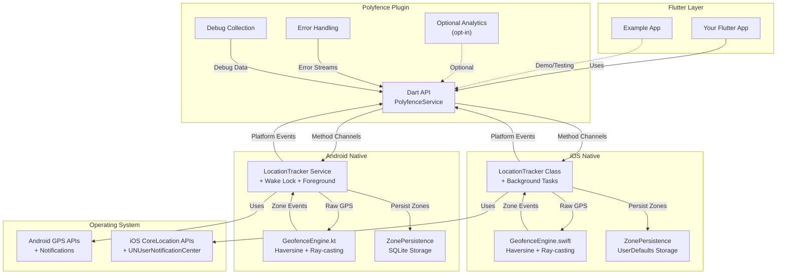

#  Polyfence

**Privacy-first, on-device geofencing for Flutter.** Accurate circle & polygon zone detection with true background operation. By default, no data leaves the device. Optional analytics is **opt‑in** and requires an **API key**.


[](https://opensource.org/licenses/MIT)


---

## ✨ Why Polyfence?

Polyfence cuts through the complexity of background geofencing with a privacy-centric API that **just works**.

| Feature | Polyfence | Other plugins |
| :-- | :-- | :-- |
| 🔒 Data privacy | **On-device only** | External/cloud services |
| 🌐 Zone types | **Circles & Polygons** | Often circles only |
| 📱 Background | **True background (iOS & Android)** | Often limited |
| 📦 Dependencies | **None** | Analytics/Play-services common |
| 🚨 Error handling | **Structured error streams** | Basic logging only |
| 🔍 Debug tools | **Comprehensive debug API** | Limited or none |
| 🔋 Battery optimization | **Built-in bypass requests** | Manual implementation |

---

## 🚀 Installation

```yaml
# pubspec.yaml
dependencies:
  polyfence:
    git:
      url: https://github.com/blackabass/polyfence-plugin.git
      ref: main

# Coming soon to pub.dev:
# polyfence: ^0.2.0
```

Then run:

```bash
flutter pub get
```

---

## 📱 Example App

### Quick Start (Demo Mode)

```bash
cd example
flutter run
```

The app loads with **3 demo zones** (🎯 Demo Zone 1, 2, 3) for instant testing - no setup required.

### Live Testing with Your Own Zones

Want to test with real zones in real locations?

1. **Get free API key**: [polyfence.io/auth/login](https://polyfence.io/auth/login)
   - Sign in with GitHub, Google, or email
   - Free tier: Create 2 zones for testing
   - No credit card required

2. **Switch to live mode**:

```dart
// example/lib/config.dart
static const bool demoMode = false;
static const String? apiKey = 'your-free-api-key-here';
```

**⚠️ Note:** The example app includes a test/demo API key (`test-demo-api-key`) for demonstration purposes only. This key has limited permissions and should **not** be used in production applications. Always use your own API key for production use.

3. **Create zones**: [Zone Management Portal](https://polyfence.io/admin)

4. **Restart app** - your zones load automatically

### Production Use

Ready to ship? [View pricing](https://polyfence.io/pricing) for unlimited zones.

---

## 🔌 Backend & Zone Management

**This plugin works with any backend** that provides zone data (circles/polygons).

### Official Backend (Optional)

- **Repository**: [polyfence backend](https://github.com/blackabass/polyfence)
- **Features**: Zone management portal, REST API, analytics dashboard
- **Live instance**: [polyfence.io](https://polyfence.io)
- **Free tier available** for testing

### Build Your Own

The plugin just needs `Zone` objects - integrate with your existing backend or build custom zone management tools.

---

## ⚡ Quick Start

### 1) Minimal usage

```dart
import 'package:polyfence/polyfence.dart';

class MyApp extends StatefulWidget {
  @override
  State<MyApp> createState() => _MyAppState();
}

class _MyAppState extends State<MyApp> {
  @override
  void initState() {
    super.initState();
    _setupPolyfence();
  }

  Future<void> _setupPolyfence() async {
    await Polyfence.instance.initialize();
    
    // Listen for enter/exit
    Polyfence.instance.onGeofenceEvent.listen((e) {
      debugPrint('${e.type.name.toUpperCase()}: ${e.zoneId}');
    });

    // Add a sample circle zone
    final zone = Zone.circle(
      id: 'hq',
      name: 'Headquarters',
      center: PolyfenceLocation(latitude: 37.422, longitude: -122.084),
      radius: 150,
    );
    await Polyfence.instance.addZone(zone);

    // Start tracking (will require permissions)
    await Polyfence.instance.startTracking();
  }
}
```


---

## ⚙️ Platform Setup

### Android — `android/app/src/main/AndroidManifest.xml`

```xml
<uses-permission android:name="android.permission.ACCESS_FINE_LOCATION" />
<uses-permission android:name="android.permission.ACCESS_COARSE_LOCATION" />
<uses-permission android:name="android.permission.ACCESS_BACKGROUND_LOCATION" />
<uses-permission android:name="android.permission.FOREGROUND_SERVICE" />
<uses-permission android:name="android.permission.FOREGROUND_SERVICE_LOCATION" />
<uses-permission android:name="android.permission.WAKE_LOCK" />
<uses-permission android:name="android.permission.REQUEST_IGNORE_BATTERY_OPTIMIZATIONS" />
```

- **minSdk**: 21+ (Android 5.0)
- **tested**: up to API 35 (Android 15)

### iOS — `ios/Runner/Info.plist`

```xml
<key>NSLocationWhenInUseUsageDescription</key>
<string>This app needs location access to detect when you enter or exit defined zones.</string>

<key>NSLocationAlwaysAndWhenInUseUsageDescription</key>
<string>Background location access is required for continuous zone monitoring.</string>

<key>UIBackgroundModes</key>
<array>
  <string>location</string>
</array>
```

- **iOS**: 12.0+
- **Requires** "Always" location for background geofencing.

---

## 🏗 How It Works



---

## ⚙️ GPS Configuration Options

Polyfence provides flexible GPS configuration to balance accuracy and battery life for your specific use case:

### Quick Configuration

```dart
// Maximum accuracy (current default behavior)
await Polyfence.instance.setAccuracyProfile(PolyfenceAccuracyProfile.maxAccuracy);

// Balanced accuracy/battery for most applications
await Polyfence.instance.setAccuracyProfile(PolyfenceAccuracyProfile.balanced);

// Battery-optimized for background monitoring
await Polyfence.instance.setAccuracyProfile(PolyfenceAccuracyProfile.batteryOptimal);

// Intelligent auto-adjustment based on context
await Polyfence.instance.setAccuracyProfile(PolyfenceAccuracyProfile.adaptive);
```

### Advanced Configuration

```dart
// Proximity-aware GPS optimization
await Polyfence.instance.updateConfiguration(
  PolyfenceConfiguration(
    accuracyProfile: PolyfenceAccuracyProfile.balanced,
    updateStrategy: PolyfenceUpdateStrategy.proximityBased,
    proximitySettings: ProximitySettings(
      nearZoneThresholdMeters: 500.0,
      farZoneThresholdMeters: 2000.0,
      nearZoneUpdateInterval: Duration(seconds: 5),
      farZoneUpdateInterval: Duration(seconds: 60),
    ),
  ),
);

// Movement-based optimization
await Polyfence.instance.updateConfiguration(
  PolyfenceConfiguration(
    updateStrategy: PolyfenceUpdateStrategy.movementBased,
    movementSettings: MovementSettings(
      stationaryThreshold: Duration(minutes: 5),
      stationaryUpdateInterval: Duration(minutes: 2),
      movingUpdateInterval: Duration(seconds: 10),
    ),
  ),
);

// Intelligent optimization (proximity + movement + battery)
await Polyfence.instance.enableIntelligentOptimization();
```

### Configuration Profiles

| Profile | GPS Accuracy | Update Interval | Battery Impact | Use Case |
|---------|-------------|-----------------|----------------|----------|
| **Max Accuracy** | High | 5 seconds (Android) | High | Delivery, navigation, fleet tracking |
| **Balanced** | Balanced | 10 seconds (Android) | Medium | Most location-aware apps |
| **Battery Optimal** | Low Power | 30 seconds (Android) | Low | Background monitoring, casual use |
| **Adaptive** | Dynamic | Dynamic (Android) | Variable | Apps with varying accuracy needs |

> **Platform Note:** Update intervals apply to Android only. iOS manages GPS frequency automatically for optimal battery life.

### Proximity-Based Optimization

```dart
await Polyfence.instance.enableProximityOptimization(
  nearThreshold: 500.0,  // High accuracy within 500m of zones
  farThreshold: 2000.0,  // Low frequency when >2km from zones
);
```

**Proximity Behavior:**

- **Inside zones**: Continuous monitoring for exit detection
- **Near zones (<500m)**: High frequency for accurate entry detection  
- **Medium distance (500m-2km)**: Graduated frequency based on distance
- **Far from zones (>2km)**: Low frequency monitoring to preserve battery

This can reduce GPS usage by 60-80% for users who spend time away from monitored zones.

---

## 🔋 Background Reliability

### Android Background Operation

- **Wake Lock Management**: Automatically acquires `PARTIAL_WAKE_LOCK` during tracking
- **Battery Optimization Bypass**: Built-in API to request exemption
- **Foreground Service**: Uses `FOREGROUND_SERVICE_LOCATION` for background updates
- **Auto-restart**: Service restarts if killed (limited to 3 attempts with cooldown)

### iOS Background Operation

- **Background Task Management**: Properly manages background tasks
- **Background Location Updates**: Uses `allowsBackgroundLocationUpdates`
- **Significant Location Changes**: Falls back when appropriate
- **App Lifecycle Integration**: Handles state transitions

### Battery Optimization (Android)

```dart
final status = await Polyfence.instance.checkBatteryOptimization();
if (!status['isOptimized'] && status['canRequest']) {
  await Polyfence.instance.requestBatteryOptimizationExemption();
}
```

---

## 🚨 Error Handling & Recovery

### Error Stream

```dart
Polyfence.instance.onError.listen((error) {
  switch (error.type) {
    case PolyfenceErrorType.batteryOptimizationRequired:
      _showBatteryOptimizationDialog();
      break;
    case PolyfenceErrorType.gpsPermissionDenied:
      _showPermissionDialog();
      break;
    case PolyfenceErrorType.serviceKilled:
      _showServiceKilledNotification();
      break;
    default:
      print('Polyfence error: ${error.message}');
  }
});
```

### Error Types

| Error Type | Description | Recommended Action |
|------------|-------------|-------------------|
| `batteryOptimizationRequired` | Android battery optimization enabled | Request exemption |
| `gpsPermissionDenied` | Location permission denied | Guide to settings |
| `gpsServiceDisabled` | GPS service disabled | Enable location services |
| `serviceKilled` | Background service terminated | Show restart notification |
| `serviceStartFailed` | Failed to start location service | Check permissions |
| `gpsTimeout` | GPS signal timeout | Retry or show status |

---

## 🔍 Debug Information API

### Get System Status

```dart
final debugInfo = await Polyfence.instance.debugInfo();

// System status
print('Location Permission: ${debugInfo.systemStatus.isLocationPermissionGranted}');
print('GPS Enabled: ${debugInfo.systemStatus.isGpsEnabled}');
print('Wake Lock Active: ${debugInfo.systemStatus.isWakeLockAcquired}');

// Performance metrics
print('Uptime: ${debugInfo.performance.uptime}');
print('Location Updates: ${debugInfo.performance.totalLocationUpdates}');
print('Memory Usage: ${debugInfo.performance.memoryUsageMB}MB');

// Battery information
print('Battery Level: ${debugInfo.battery.batteryLevel}%');
print('Is Charging: ${debugInfo.battery.isCharging}');

// Zone status
print('Active Zones: ${debugInfo.zones.activeZones}');
```

### Error History

```dart
final recentErrors = await Polyfence.instance.errorHistory(
  timeRange: Duration(hours: 24),
);
```

---

## 🔧 Common Tasks

### Add/Remove Zones

```dart
final office = Zone.circle(
  id: 'office',
  name: 'Office',
  center: PolyfenceLocation(latitude: 51.5074, longitude: -0.1278),
  radius: 120,
);

final campus = Zone.polygon(
  id: 'campus',
  name: 'Campus',
  points: [
    PolyfenceLocation(latitude: 51.5079, longitude: -0.1284),
    PolyfenceLocation(latitude: 51.5090, longitude: -0.1240),
    PolyfenceLocation(latitude: 51.5050, longitude: -0.1230),
  ],
);

await Polyfence.instance.addZone(office);
await Polyfence.instance.addZone(campus);
```

### Start/Stop Tracking

```dart
await Polyfence.instance.startTracking();
await Polyfence.instance.stopTracking();
```

---

## 🧪 Example App

The included example demonstrates production patterns for geofencing integration.

**Features:**

- Testing zone entry/exit detection
- Observing plugin behavior across app states  
- Evaluating battery impact of different GPS profiles
- Reference implementation for integration

⚠️ **Note:** GPS Profile adjustments (Max, Balanced, Battery, Smart) apply to Android only. iOS manages GPS frequency automatically.

<details>
  <summary>Screenshots (expand)</summary>

  <p>
    
    
    
    
  </p>
</details>

---

## 🔒 Privacy & Security

- All geofencing logic runs on-device
- No data transmission by default
- Optional analytics is opt-in and requires explicit API key
- GDPR/CCPA-friendly by design

---

## 🧰 Compatibility

| Platform | Min | Target | Notes |
|----------|-----|--------|-------|
| Android | 21 | 34–35 | Foreground service for background tracking |
| iOS | 12.0 | Latest | Requires "Always" location for background |

---

## 📚 Documentation

Full documentation available in the `/docs` directory:

- **Setup**: Platform-specific configuration guides
- **Integration**: End-to-end examples and patterns  
- **Troubleshooting**: Common issues and solutions
- **API Reference**: Complete API documentation

---

## 🙋 Support

- **Plugin Issues**: [GitHub Issues](https://github.com/blackabass/polyfence-plugin/issues)
- **Discussions**: [GitHub Discussions](https://github.com/blackabass/polyfence-plugin/discussions)
- **Backend/Portal**: [Main Repository](https://github.com/blackabass/polyfence)

---

## 📜 License

MIT — see [LICENSE](LICENSE)

