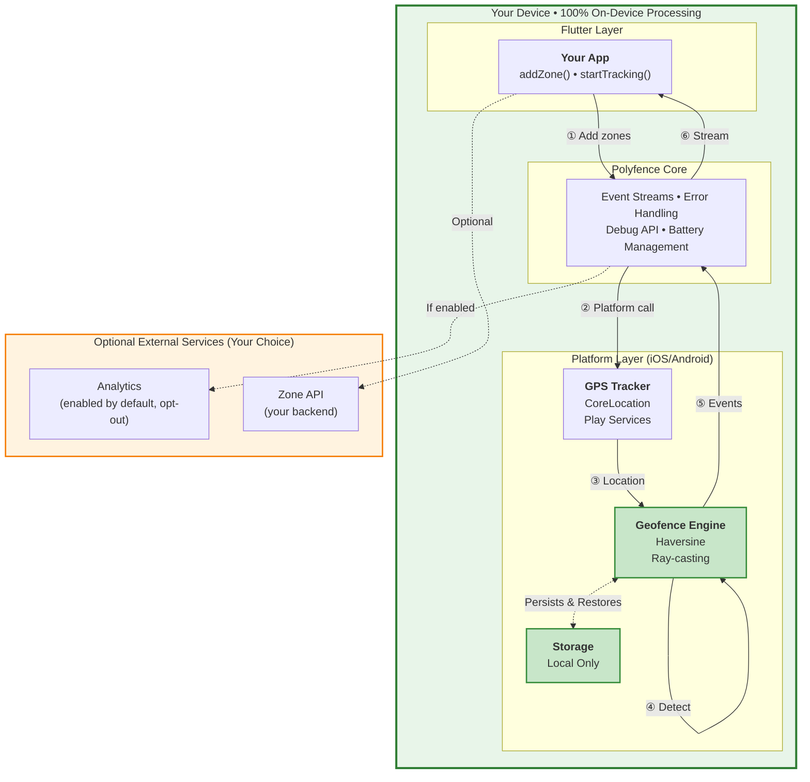

#  Polyfence

**Privacy-first, on-device geofencing for Flutter.** Accurate circle & polygon zone detection with true background operation. No location data or PII ever transmitted. Anonymous plugin telemetry enabled by default ([opt-out](#telemetry-opt-out)).


[](https://opensource.org/licenses/MIT)


---

## 🎯 No Backend Required

**Polyfence works 100% standalone.** No account signup, no API key, no external services needed.

The plugin runs entirely on-device using native GPS APIs. Your geofencing logic, your zones, your data—all local by default.

```dart
// That's it. No API key, no backend, no setup.
await Polyfence.instance.initialize();
await Polyfence.instance.addZone(Zone.circle(...));
await Polyfence.instance.startTracking();
```

**Three ways to use Polyfence** (choose what fits your workflow):

| Approach | Backend | API Key | Best For |
|----------|---------|---------|----------|
| **Hardcode zones in your app** | None | Not needed | Static zones, full control, privacy-first apps |
| **Fetch from your own API** | Your backend | Not needed | Existing infrastructure, custom zone logic |
| **Use Polyfence SaaS** _(optional)_ | polyfence.io | Required | Visual zone editor, analytics dashboard |

All three approaches use the **same plugin API**—switch anytime without code changes.

---

## ✨ Why Polyfence?

Polyfence cuts through the complexity of background geofencing with a privacy-centric API that **just works**.

| Feature | Polyfence | Other plugins |
| :-- | :-- | :-- |
| 🔒 Data privacy | **On-device only** | External/cloud services |
| 🌐 Zone types | **Circles & Polygons** | Often circles only |
| 📱 Background | **True background (iOS & Android)** | Often limited |
| 📦 Dependencies | **Minimal** (Play Services Location on Android) | Heavy analytics/cloud SDKs |
| 🚨 Error handling | **Structured error streams** | Basic logging only |
| 🔍 Debug tools | **Comprehensive debug API** | Limited or none |
| 🔋 Battery optimization | **Built-in bypass requests** | Manual implementation |

---

## 🚀 Installation

```yaml
# pubspec.yaml
dependencies:
  polyfence:
    git:
      url: https://github.com/blackabass/polyfence-plugin.git
      ref: main

# Available on pub.dev (coming soon):
# polyfence: ^0.2.0
```

**Current version:** 0.3.0

Then run:

```bash
flutter pub get
```

> **💡 New to Polyfence?** Try the example app first: `cd example && flutter run` (works immediately, no setup needed)

---

## ⚡ Quick Start

### Standalone Mode (No Backend)

The simplest way to use Polyfence—define zones directly in your code:

```dart
import 'dart:async';
import 'package:polyfence/polyfence.dart';

class MyApp extends StatefulWidget {
  @override
  State<MyApp> createState() => _MyAppState();
}

class _MyAppState extends State<MyApp> {
  StreamSubscription<GeofenceEvent>? _geofenceSubscription;

  @override
  void initState() {
    super.initState();
    _setupPolyfence();
  }

  @override
  void dispose() {
    _geofenceSubscription?.cancel();
    super.dispose();
  }

  Future<void> _setupPolyfence() async {
    try {
      // Initialize plugin (no API key needed)
      await Polyfence.instance.initialize();

      // Request permissions first (required for background tracking)
      final hasPermission = await Polyfence.instance.requestPermissions(always: true);
      if (!hasPermission) {
        print('Location permission denied. Geofencing will not work.');
        return;
      }

      // Listen for enter/exit events
      _geofenceSubscription = Polyfence.instance.onGeofenceEvent.listen(
        (event) {
          print('${event.type.name.toUpperCase()}: ${event.zoneId}');
          print('Location: ${event.location.latitude}, ${event.location.longitude}');
        },
        onError: (error) {
          print('Geofence error: $error');
        },
      );

      // Add zones directly in code
      final office = Zone.circle(
        id: 'office',
        name: 'Office',
        center: PolyfenceLocation(latitude: 37.422, longitude: -122.084),
        radius: 150,
      );

      final warehouse = Zone.polygon(
        id: 'warehouse',
        name: 'Warehouse',
        polygon: [
          PolyfenceLocation(latitude: 37.423, longitude: -122.085),
          PolyfenceLocation(latitude: 37.424, longitude: -122.086),
          PolyfenceLocation(latitude: 37.425, longitude: -122.087),
        ],
      );

      await Polyfence.instance.addZone(office);
      await Polyfence.instance.addZone(warehouse);

      // Start tracking
      await Polyfence.instance.startTracking();
      print('Polyfence tracking started with ${(await Polyfence.instance.getZones()).length} zones');
    } on PolyfenceNotInitializedException {
      print('Polyfence not initialized');
    } on PlatformOperationException catch (e) {
      print('Platform error: ${e.message}');
    } catch (e) {
      print('Unexpected error: $e');
    }
  }
}
```

**Zones are automatically persisted** across app restarts—no database setup needed.


---

### With Your Own Backend

Fetch zones from your existing API:

```dart
Future<void> _loadZonesFromMyBackend() async {
  // Call your own API
  final response = await http.get(Uri.parse('https://myapi.com/geofence-zones'));
  final List<dynamic> zonesJson = json.decode(response.body);

  // Convert to Polyfence Zone objects
  for (var zoneData in zonesJson) {
    final zone = Zone.circle(
      id: zoneData['id'],
      name: zoneData['name'],
      center: PolyfenceLocation(
        latitude: zoneData['latitude'],
        longitude: zoneData['longitude'],
      ),
      radius: zoneData['radius'].toDouble(),
    );

    await Polyfence.instance.addZone(zone);
  }

  await Polyfence.instance.startTracking();
}
```

**Note:** The plugin doesn't care where zones come from—it just needs `Zone` objects. Use any backend, any API format, any authentication method you want.

---

### With Polyfence SaaS (Optional)

Use our hosted zone management service for a visual zone editor and analytics:

```dart
import 'package:polyfence_api/zone_api_service.dart'; // Example integration

Future<void> _loadZonesFromPolyfenceSaaS() async {
  // Requires API key from https://polyfence.io (free tier available)
  final zones = await ZoneApiService.fetchActiveZones();

  for (var zone in zones) {
    await Polyfence.instance.addZone(zone);
  }

  await Polyfence.instance.startTracking();
}
```

See `example/lib/zone_api_service.dart` for a complete integration example.

---

## 📊 Zone Limits

| Limit | Value | Platform |
| :-- | :-- | :-- |
| **Maximum zones** | No hard limit | Both |
| **Maximum polygon points** | 50 per polygon | Both |
| **Minimum polygon points** | 3 per polygon | Both |

**Notes:**
- **No zone count limit**: Add as many zones as your use case requires (tested with 100+ zones on both platforms)
- **Polygon complexity limit**: Maximum 50 points per polygon to ensure efficient ray-casting performance
- **Performance considerations**: Modern devices handle 100+ zones efficiently. Battery impact scales with GPS frequency, not zone count
- These limits apply per device, not per app instance

---

## ⚙️ Platform Setup

### Android — `android/app/src/main/AndroidManifest.xml`

```xml
<uses-permission android:name="android.permission.ACCESS_FINE_LOCATION" />
<uses-permission android:name="android.permission.ACCESS_COARSE_LOCATION" />
<uses-permission android:name="android.permission.ACCESS_BACKGROUND_LOCATION" />
<uses-permission android:name="android.permission.FOREGROUND_SERVICE" />
<uses-permission android:name="android.permission.FOREGROUND_SERVICE_LOCATION" />
<uses-permission android:name="android.permission.WAKE_LOCK" />
<uses-permission android:name="android.permission.REQUEST_IGNORE_BATTERY_OPTIMIZATIONS" />
```

- **minSdk**: 21+ (Android 5.0)
- **tested**: up to API 35 (Android 15)
- **dependency**: Google Play Services Location 21.0.1 (automatically included)

#### Foreground Service Notification

Polyfence requires a foreground service notification on Android. **The plugin automatically creates the notification channel** - no additional setup required.

**Note:** The plugin will automatically show a persistent notification while tracking. This is required by Android for foreground services and cannot be disabled. The notification uses low priority and is silent, so it won't disturb users.

### iOS — `ios/Runner/Info.plist`

```xml
<key>NSLocationWhenInUseUsageDescription</key>
<string>This app needs location access to detect when you enter or exit defined zones.</string>

<key>NSLocationAlwaysAndWhenInUseUsageDescription</key>
<string>Background location access is required for continuous zone monitoring.</string>

<key>UIBackgroundModes</key>
<array>
  <string>location</string>
</array>
```

- **iOS**: 12.0+
- **Requires** "Always" location for background geofencing.

#### iOS Permission Flow

**Important:** iOS requires "Always" location permission for background geofencing, but the flow is different from Android:

1. **First Request:** When you call `requestPermissions(always: true)`, iOS shows a "While in use" permission dialog
2. **Manual Step Required:** The user must manually enable "Always" permission in:
   - Settings → Privacy & Security → Location Services → Your App → "Always"
3. **Check Permission Status:** Your app should check if "Always" permission is granted:

```dart
// Check location service status
final isEnabled = await Polyfence.instance.isLocationServiceEnabled();
if (!isEnabled) {
  // Guide user to enable location services
}

// Request permissions (shows "While in use" dialog first)
final granted = await Polyfence.instance.requestPermissions(always: true);
if (granted) {
  // User granted "While in use" - they still need to enable "Always" in Settings
  // You may want to show a dialog guiding them to Settings
}
```

**Note:** iOS doesn't provide a direct API to check if "Always" permission is granted. The plugin will work with "While in use" but background geofencing requires "Always" permission.

---

## 🏗 How It Works



**Architecture Highlights:**

🔒 **Privacy First**
- All geofencing calculations happen on-device using Haversine distance (circles) and Ray-casting (polygons)
- Zero external API calls by default—everything in the green box stays local
- Anonymous plugin telemetry enabled by default (easy opt-out), zone APIs are optional

💾 **Automatic Persistence**
- Zones automatically save to local storage (UserDefaults on iOS, SharedPreferences on Android)
- Survive app kills, crashes, and device restarts
- No manual database management needed

📡 **Event Flow**
1. Your app adds zones via `addZone()`
2. GPS tracker monitors device location
3. Geofence engine checks if location crosses zone boundaries
4. Entry/Exit events stream back to your app in real-time
5. Zones persist locally for next app launch

---

## ⚙️ GPS Configuration Options

Polyfence provides flexible GPS configuration to balance accuracy and battery life for your specific use case:

### Quick Configuration

```dart
// Maximum accuracy (current default behavior)
await Polyfence.instance.setAccuracyProfile(PolyfenceAccuracyProfile.maxAccuracy);

// Balanced accuracy/battery for most applications
await Polyfence.instance.setAccuracyProfile(PolyfenceAccuracyProfile.balanced);

// Battery-optimized for background monitoring
await Polyfence.instance.setAccuracyProfile(PolyfenceAccuracyProfile.batteryOptimal);

// Intelligent auto-adjustment based on context
await Polyfence.instance.setAccuracyProfile(PolyfenceAccuracyProfile.adaptive);
```

### Advanced Configuration

```dart
// Proximity-aware GPS optimization
await Polyfence.instance.updateGpsConfiguration(
  PolyfenceConfiguration(
    accuracyProfile: PolyfenceAccuracyProfile.balanced,
    updateStrategy: PolyfenceUpdateStrategy.proximityBased,
    proximitySettings: ProximitySettings(
      nearZoneThresholdMeters: 500.0,
      farZoneThresholdMeters: 2000.0,
      nearZoneUpdateInterval: Duration(seconds: 5),
      farZoneUpdateInterval: Duration(seconds: 60),
    ),
  ),
);

// Movement-based optimization
await Polyfence.instance.updateGpsConfiguration(
  PolyfenceConfiguration(
    updateStrategy: PolyfenceUpdateStrategy.movementBased,
    movementSettings: MovementSettings(
      stationaryThreshold: Duration(minutes: 5),
      stationaryUpdateInterval: Duration(minutes: 2),
      movingUpdateInterval: Duration(seconds: 10),
    ),
  ),
);

// Intelligent optimization (proximity + movement + battery)
await Polyfence.instance.enableIntelligentOptimization();
```

### GPS Accuracy Threshold

By default, Polyfence rejects GPS readings with accuracy worse than **100 meters** to ensure consistent behavior across iOS and Android. This threshold is configurable:

```dart
await Polyfence.instance.updateGpsConfiguration(
  PolyfenceConfiguration(
    gpsAccuracyThreshold: 50.0, // 50 meters - stricter
    // Or
    gpsAccuracyThreshold: 200.0, // 200 meters - more lenient
  ),
);
```

**Note:** The default 100m threshold ensures platform parity. Previously, iOS used 500m and Android used 100m, which could cause inconsistent behavior. Both platforms now use 100m by default.

### Configuration Profiles

| Profile | GPS Accuracy | Update Interval | Battery Impact | Use Case |
|---------|-------------|-----------------|----------------|----------|
| **Max Accuracy** | High | 5 seconds (Android) | High | Delivery, navigation, fleet tracking |
| **Balanced** | Balanced | 10 seconds (Android) | Medium | Most location-aware apps |
| **Battery Optimal** | Low Power | 30 seconds (Android) | Low | Background monitoring, casual use |
| **Adaptive** | Dynamic | Dynamic (Android) | Variable | Apps with varying accuracy needs |

> **Platform Note:** Update intervals apply to Android only. iOS manages GPS frequency automatically for optimal battery life.

### Proximity-Based Optimization

```dart
await Polyfence.instance.enableProximityOptimization(
  nearThreshold: 500.0,  // High accuracy within 500m of zones
  farThreshold: 2000.0,  // Low frequency when >2km from zones
);
```

**Proximity Behavior:**

- **Inside zones**: Continuous monitoring for exit detection
- **Near zones (<500m)**: High frequency for accurate entry detection
- **Medium distance (500m-2km)**: Graduated frequency based on distance
- **Far from zones (>2km)**: Low frequency monitoring to preserve battery

This can reduce GPS usage by 60-80% for users who spend time away from monitored zones.

---

## 🔋 Background Reliability

### Android Background Operation

- **Wake Lock Management**: Automatically acquires `PARTIAL_WAKE_LOCK` during tracking with 12-hour timeout and auto-renewal (properly released on stop or timeout)
- **Battery Optimization Bypass**: Built-in API to request exemption
- **Foreground Service**: Uses `FOREGROUND_SERVICE_LOCATION` for background updates
- **Auto-restart**: Service restarts if killed (limited to 3 attempts with cooldown)
- **GPS Recovery**: Automatically recovers from GPS failures (up to 5 consecutive attempts before giving up)

### iOS Background Operation

- **Background Task Management**: Properly manages background tasks
- **Background Location Updates**: Uses `allowsBackgroundLocationUpdates`
- **Significant Location Changes**: Falls back when appropriate
- **App Lifecycle Integration**: Handles state transitions

### Battery Optimization (Android)

```dart
final status = await Polyfence.instance.batteryOptimizationStatus();
if (status['isOptimized'] == true && status['canRequest'] == true) {
  await Polyfence.instance.requestBatteryOptimizationExemption();
}
```

---

## 🚨 Error Handling & Recovery

### Error Stream

```dart
Polyfence.instance.onError.listen((error) {
  switch (error.type) {
    case PolyfenceErrorType.batteryOptimizationRequired:
      _showBatteryOptimizationDialog();
      break;
    case PolyfenceErrorType.gpsPermissionDenied:
      _showPermissionDialog();
      break;
    case PolyfenceErrorType.serviceKilled:
      _showServiceKilledNotification();
      break;
    default:
      print('Polyfence error: ${error.message}');
  }
});
```

### Exception Types

Polyfence throws structured exceptions for better error handling:

- **`PolyfenceNotInitializedException`**: Thrown when plugin methods are called before `initialize()`
- **`PlatformOperationException`**: Thrown when platform operations fail (includes operation name and error message)

**Example:**
```dart
try {
  await Polyfence.instance.startTracking();
} on PolyfenceNotInitializedException {
  await Polyfence.instance.initialize();
  await Polyfence.instance.startTracking();
} on PlatformOperationException catch (e) {
  print('Platform error in ${e.operation}: ${e.message}');
}
```

### Error Types

| Error Type | Description | Recommended Action |
|------------|-------------|-------------------|
| `batteryOptimizationRequired` | Android battery optimization enabled | Request exemption |
| `gpsPermissionDenied` | Location permission denied | Guide to settings |
| `gpsServiceDisabled` | GPS service disabled | Enable location services |
| `serviceKilled` | Background service terminated | Show restart notification |
| `serviceStartFailed` | Failed to start location service | Check permissions |
| `gpsTimeout` | GPS signal timeout | Retry or show status |

---

## 🔍 Debug Information API

### Get System Status

```dart
final debugInfo = await Polyfence.instance.debugInfo();

// System status
print('Location Permission: ${debugInfo.systemStatus.isLocationPermissionGranted}');
print('GPS Enabled: ${debugInfo.systemStatus.isGpsEnabled}');
print('Wake Lock Active: ${debugInfo.systemStatus.isWakeLockAcquired}');

// Performance metrics
print('Uptime: ${debugInfo.performance.uptime}');
print('Location Updates: ${debugInfo.performance.totalLocationUpdates}');
print('Memory Usage: ${debugInfo.performance.memoryUsageMB}MB');

// Battery information
print('Battery Level: ${debugInfo.battery.batteryLevel}%');
print('Is Charging: ${debugInfo.battery.isCharging}');

// Zone status
print('Active Zones: ${debugInfo.zones.activeZones}');
```

### Error History

```dart
final recentErrors = await Polyfence.instance.errorHistory(
  timeRange: Duration(hours: 24),
);
```

---

## 🔧 Common Tasks

### Add/Remove Zones

```dart
final office = Zone.circle(
  id: 'office',
  name: 'Office',
  center: PolyfenceLocation(latitude: 51.5074, longitude: -0.1278),
  radius: 120,
);

final campus = Zone.polygon(
  id: 'campus',
  name: 'Campus',
  polygon: [
    PolyfenceLocation(latitude: 51.5079, longitude: -0.1284),
    PolyfenceLocation(latitude: 51.5090, longitude: -0.1240),
    PolyfenceLocation(latitude: 51.5050, longitude: -0.1230),
  ],
);

await Polyfence.instance.addZone(office);
await Polyfence.instance.addZone(campus);
```

### Start/Stop Tracking

```dart
await Polyfence.instance.startTracking();
await Polyfence.instance.stopTracking();
```

---

## ⚠️ Common Gotchas

### iOS "Always" Permission
- iOS requires **manual** "Always" permission enablement in Settings after the first "While in use" grant
- The plugin will work with "While in use" but background geofencing requires "Always"
- Guide users to Settings → Privacy & Security → Location Services → Your App → "Always"

### Android Battery Optimization
- Android may kill background services if battery optimization is enabled
- Check status: `await Polyfence.instance.batteryOptimizationStatus()`
- Request exemption: `await Polyfence.instance.requestBatteryOptimizationExemption()`
- This is especially important for reliable background tracking

### GPS Accuracy Threshold
- Default threshold is **100 meters** - locations with worse accuracy are rejected
- This ensures consistent behavior across iOS and Android
- Configure via `updateGpsConfiguration()` if needed

### Background Tracking Requirements
- **Android:** Requires foreground service notification (automatically created by plugin)
- **iOS:** Requires "Always" location permission (manual setup in Settings)
- Both platforms require proper permissions before `startTracking()`

### Stream Subscription Management
- Always cancel stream subscriptions in `dispose()` to prevent memory leaks
- **Note:** The plugin automatically handles all resource cleanup including stream controllers, analytics sessions, and platform resources. Apps don't need to manually manage plugin lifecycle.
- Example: `_geofenceSubscription?.cancel();`

### Zone Persistence & Synchronization
- Zones are automatically persisted across app restarts
- No manual persistence needed
- Zones are loaded automatically when plugin initializes
- Zone state persists through app kills, crashes, and restarts

**Note:** When loading zones from an external source, consider implementing delta-based sync to avoid re-registering all zones on each load.

---

## 🧪 Example App

A complete example app is included in the `example/` directory.

### Run the Example

**Standalone mode** (works immediately, no setup):
```bash
cd example
flutter run
```

The app starts with 3 hardcoded zones. **This is a valid production pattern**, not just a demo—many apps have static zones.

### Using Zones from Polyfence SaaS

To fetch zones from polyfence.io instead of hardcoding:

1. Set `demoMode = false` in `example/lib/config.dart`
2. Get your free API key from [polyfence.io](https://polyfence.io)
3. Add the key to `example/lib/config.dart`: `static const String? apiKey = 'your-key';`
4. Restart the app

### What the Example Demonstrates

- ✅ **Standalone zone management** (hardcoded zones in `demo_zones.dart`)
- ✅ **API integration pattern** (fetch zones from polyfence.io in `zone_api_service.dart`)
- ✅ **Delta-based sync** (efficient zone updates without re-registering all zones)
- ✅ **Zone entry/exit event handling**
- ✅ **Background tracking** across app states
- ✅ **GPS profile switching** (Android)
- ✅ **Permission request flow**
- ✅ **Error stream handling**

<details>
  <summary>📸 Example App Screenshots</summary>

  <p>
    
    
    
    
  </p>
</details>

---

## ❓ FAQ

### Do I need a polyfence.io account to use this plugin?

**No.** The plugin works 100% standalone without any account, API key, or backend. You can hardcode zones directly in your Flutter app or fetch them from your own API. The polyfence.io service is completely optional.

### Can I use this plugin without any backend at all?

**Yes.** Just add zones programmatically:

```dart
await Polyfence.instance.addZone(Zone.circle(
  id: 'home',
  name: 'Home',
  center: PolyfenceLocation(latitude: 37.422, longitude: -122.084),
  radius: 200,
));
```

Zones are automatically persisted on-device and survive app restarts. No database, no backend, no API needed.

### Can I manage zones without leaving my code editor?

**Yes.** Define zones as constants in your Dart code:

```dart
// zones.dart
final List<Zone> myZones = [
  Zone.circle(
    id: 'office',
    name: 'Office',
    center: PolyfenceLocation(latitude: 37.422, longitude: -122.084),
    radius: 150,
  ),
  Zone.circle(
    id: 'home',
    name: 'Home',
    center: PolyfenceLocation(latitude: 37.785, longitude: -122.406),
    radius: 200,
  ),
];

// In your app
for (var zone in myZones) {
  await Polyfence.instance.addZone(zone);
}
```

Version control your zones alongside your code. No UI, no CLI, no backend needed.

### What's the difference between demo zones and production zones?

There's no difference. "Demo zones" in the example app are just hardcoded `Zone` objects—the same objects you'd create in production code. Hardcoding zones is a valid production approach if your zones are static or change infrequently.

### Can I use my own backend for zone management?

**Yes.** The plugin is backend-agnostic. It only needs `Zone` objects—it doesn't care where they come from. Fetch zones from your API, convert the JSON to `Zone` objects, and add them to the plugin. Use any authentication, any data format, any backend framework you want.

### Does the plugin send any data to external servers?

**Yes, anonymous plugin telemetry is sent by default** (easy opt-out). No location data or PII is ever transmitted.

**What's sent automatically:**
- Anonymous plugin performance metrics (detection times, battery usage, error counts)
- App package name and platform (Android/iOS)
- Plugin version

**What's NEVER sent:**
- GPS coordinates or location data
- Zone definitions or boundaries
- User identifiers or personal information

**See full details:** [Telemetry Reference](docs/TELEMETRY.md)

**Opt-out (one line):**
```dart
await Polyfence.instance.initialize(
  analyticsConfig: AnalyticsConfig(
    disableTelemetry: true,
  ),
);
```

**Other network calls:**
- If you fetch zones from an external API (your choice)
- No other network calls are made

**Note:** The plugin automatically manages analytics session lifecycle (start/end sessions based on app lifecycle). Apps don't need to manually call `startSession()` or `endSession()`—the plugin handles this automatically.

### How do I switch from standalone to SaaS (or vice versa)?

The plugin API is identical for all deployment modes. To switch:

**From hardcoded to API:**
```dart
// Before: Hardcoded
await Polyfence.instance.addZone(Zone.circle(...));

// After: Fetch from API
final zones = await fetchZonesFromMyAPI(); // Your implementation
for (var zone in zones) {
  await Polyfence.instance.addZone(zone);
}
```

**From SaaS to standalone:**
```dart
// Before: Polyfence SaaS
final zones = await ZoneApiService.fetchActiveZones();

// After: Hardcoded
final zones = [
  Zone.circle(id: 'office', name: 'Office', ...),
  Zone.circle(id: 'home', name: 'Home', ...),
];

// Same code after fetching
for (var zone in zones) {
  await Polyfence.instance.addZone(zone);
}
```

No code changes needed beyond how you obtain the `Zone` objects.

---

## 🔒 Privacy & Security

Polyfence is built with privacy as the foundation. Here's what we protect and what we collect:

### What We NEVER Send

- ❌ **GPS coordinates** or location data
- ❌ **Zone definitions** or boundaries
- ❌ **User identifiers** (name, email, phone, device ID)
- ❌ **Personal information** of any kind

**Your users' location data stays on their device. Always.**

### Anonymous Plugin Telemetry (Enabled by Default)

To monitor plugin performance and improve reliability, Polyfence sends **anonymous performance metrics**:

✅ **What's sent:**
- Plugin version and platform (Android/iOS)
- App package name (e.g., "com.example.logistics")
- Performance metrics (detection times, GPS accuracy averages)
- Battery impact statistics
- Error counts and types
- Zone type usage (circle/polygon counts—not locations)

✅ **Why we need this:**
- Detect performance issues early
- Optimize battery usage
- Fix bugs faster
- Improve reliability across devices

✅ **See exactly what's sent:** [Full Telemetry Reference](docs/TELEMETRY.md)

### Telemetry Opt-Out

Disable telemetry with one line of code:

```dart
await Polyfence.instance.initialize(
  analyticsConfig: AnalyticsConfig(
    disableTelemetry: true, // ← Disable all telemetry
  ),
);
```

### Architecture Guarantees

- **On-device geofencing**: All zone detection runs locally using native GPS APIs
- **Local persistence**: Zones stored in SharedPreferences (Android) / UserDefaults (iOS)
- **No tracking**: No user behavior tracking, no cross-app tracking
- **GDPR/CCPA-friendly**: Anonymous telemetry only, easy opt-out

**Privacy guarantee:** Polyfence never transmits location coordinates, zone definitions, or personal information. Plugin telemetry is anonymous and contains no user data.

---

## 🧰 Compatibility

| Platform | Min | Target | Notes |
|----------|-----|--------|-------|
| Android | 21 | 34–35 | Foreground service for background tracking. Tested up to API 35 (Android 15) |
| iOS | 12.0 | Latest | Requires "Always" location for background |

---

## 📚 Documentation

- **CHANGELOG**: See [CHANGELOG.md](CHANGELOG.md) for version history and recent improvements
- **Quick Start**: See [Quick Start](#-quick-start) section above
- **Platform Setup**: See [Platform Setup](#️-platform-setup) section
- **API Reference**: Generate API docs locally with `dart doc` (outputs to `doc/api/` folder). For online docs, see [pub.dev package page](https://pub.dev/packages/polyfence) when published.

---

## 🙋 Support

- **Plugin Issues**: [GitHub Issues](https://github.com/blackabass/polyfence-plugin/issues)
- **Questions & Discussions**: Open an issue with the `question` label
- **Commercial Support**: [polyfence.io](https://polyfence.io)

---

## 📜 License

MIT — see [LICENSE](LICENSE)
