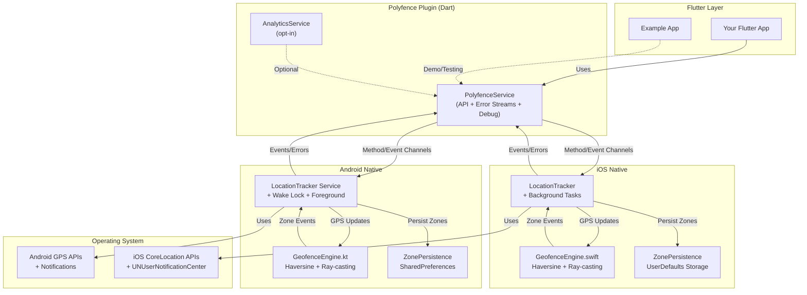

#  Polyfence

**Privacy-first, on-device geofencing for Flutter.** Accurate circle & polygon zone detection with true background operation. By default, no data leaves the device. Optional analytics is **opt‑in** and requires an **API key**.


[](https://opensource.org/licenses/MIT)


---

## ✨ Why Polyfence?

Polyfence cuts through the complexity of background geofencing with a privacy-centric API that **just works**.

| Feature | Polyfence | Other plugins |
| :-- | :-- | :-- |
| 🔒 Data privacy | **On-device only** | External/cloud services |
| 🌐 Zone types | **Circles & Polygons** | Often circles only |
| 📱 Background | **True background (iOS & Android)** | Often limited |
| 📦 Dependencies | **None** | Analytics/Play-services common |
| 🚨 Error handling | **Structured error streams** | Basic logging only |
| 🔍 Debug tools | **Comprehensive debug API** | Limited or none |
| 🔋 Battery optimization | **Built-in bypass requests** | Manual implementation |

---

## 🚀 Installation

```yaml
# pubspec.yaml
dependencies:
  polyfence:
    git:
      url: https://github.com/blackabass/polyfence-plugin.git
      ref: main

# Available on pub.dev (coming soon):
# polyfence: ^0.2.0
```

Then run:

```bash
flutter pub get
```

---

## 📱 Example App

### Quick Start (Demo Mode)

```bash
cd example
flutter run
```

The app loads with **3 demo zones** (🎯 Demo Zone 1, 2, 3) for instant testing - no setup required.

### Live Testing with Your Own Zones

Want to test with real zones in real locations?

1. **Get free API key**: [polyfence.io/auth/login](https://polyfence.io/auth/login)
   - Sign in with GitHub, Google, or email
   - Free tier: Create 2 zones for testing
   - No credit card required

2. **Switch to live mode**:

```dart
// example/lib/config.dart
static const bool demoMode = false;
static const String? apiKey = 'your-free-api-key-here'; // Get from https://polyfence.io/auth/login
```

**⚠️ Note:** The example app includes a test/demo API key for demonstration purposes only. This key has limited permissions and should **not** be used in production applications. Always use your own API key for production use.

3. **Create zones**: [Zone Management Portal](https://polyfence.io/admin)

4. **Restart app** - your zones load automatically

### Production Use

Ready to ship? [View pricing](https://polyfence.io/pricing) for unlimited zones.

---

## 🔌 Backend & Zone Management

**This plugin works with any backend** that provides zone data (circles/polygons).

### Official Backend (Optional)

- **Repository**: [polyfence backend](https://github.com/blackabass/polyfence)
- **Features**: Zone management portal, REST API, analytics dashboard
- **Live instance**: [polyfence.io](https://polyfence.io)
- **Free tier available** for testing

### Build Your Own

The plugin just needs `Zone` objects - integrate with your existing backend or build custom zone management tools.

---

## ⚡ Quick Start

### 1) Minimal usage

```dart
import 'dart:async';
import 'package:polyfence/polyfence.dart';

class MyApp extends StatefulWidget {
  @override
  State<MyApp> createState() => _MyAppState();
}

class _MyAppState extends State<MyApp> {
  StreamSubscription<GeofenceEvent>? _geofenceSubscription;

  @override
  void initState() {
    super.initState();
    _setupPolyfence();
  }

  @override
  void dispose() {
    _geofenceSubscription?.cancel();
    super.dispose();
  }

  Future<void> _setupPolyfence() async {
    try {
      // Initialize plugin
      await Polyfence.instance.initialize();
      
      // Request permissions first (required for background tracking)
      final hasPermission = await Polyfence.instance.requestPermissions(always: true);
      if (!hasPermission) {
        print('Location permission denied. Geofencing will not work.');
        return;
      }
      
      // Listen for enter/exit events
      _geofenceSubscription = Polyfence.instance.onGeofenceEvent.listen(
        (event) {
          print('${event.type.name.toUpperCase()}: ${event.zoneId}');
          print('Location: ${event.location.latitude}, ${event.location.longitude}');
        },
        onError: (error) {
          print('Geofence error: $error');
        },
      );

      // Add a sample circle zone
      final zone = Zone.circle(
        id: 'hq',
        name: 'Headquarters',
        center: PolyfenceLocation(latitude: 37.422, longitude: -122.084),
        radius: 150,
      );
      await Polyfence.instance.addZone(zone);

      // Start tracking
      await Polyfence.instance.startTracking();
      print('Polyfence tracking started');
    } on PolyfenceNotInitializedException {
      print('Polyfence not initialized');
    } on PlatformOperationException catch (e) {
      print('Platform error: ${e.message}');
    } catch (e) {
      print('Unexpected error: $e');
    }
  }
}
```


---

## 📊 Zone Limits

Polyfence enforces limits to ensure optimal performance and memory usage:

| Limit | Value | Platform |
| :-- | :-- | :-- |
| **Maximum zones** | 50 | iOS |
| **Maximum zones** | Unlimited | Android |
| **Maximum polygon points** | 50 per polygon | Both |
| **Minimum polygon points** | 3 per polygon | Both |

These limits are enforced at the platform level. If you exceed them, `addZone()` will throw an error.

---

## ⚙️ Platform Setup

### Android — `android/app/src/main/AndroidManifest.xml`

```xml
<uses-permission android:name="android.permission.ACCESS_FINE_LOCATION" />
<uses-permission android:name="android.permission.ACCESS_COARSE_LOCATION" />
<uses-permission android:name="android.permission.ACCESS_BACKGROUND_LOCATION" />
<uses-permission android:name="android.permission.FOREGROUND_SERVICE" />
<uses-permission android:name="android.permission.FOREGROUND_SERVICE_LOCATION" />
<uses-permission android:name="android.permission.WAKE_LOCK" />
<uses-permission android:name="android.permission.REQUEST_IGNORE_BATTERY_OPTIMIZATIONS" />
```

- **minSdk**: 21+ (Android 5.0)
- **tested**: up to API 35 (Android 15)

#### Foreground Service Notification

Polyfence requires a foreground service notification on Android. **The plugin automatically creates the notification channel** - no additional setup required.

**Note:** The plugin will automatically show a persistent notification while tracking. This is required by Android for foreground services and cannot be disabled. The notification uses low priority and is silent, so it won't disturb users.

### iOS — `ios/Runner/Info.plist`

```xml
<key>NSLocationWhenInUseUsageDescription</key>
<string>This app needs location access to detect when you enter or exit defined zones.</string>

<key>NSLocationAlwaysAndWhenInUseUsageDescription</key>
<string>Background location access is required for continuous zone monitoring.</string>

<key>UIBackgroundModes</key>
<array>
  <string>location</string>
</array>
```

- **iOS**: 12.0+
- **Requires** "Always" location for background geofencing.

#### iOS Permission Flow

**Important:** iOS requires "Always" location permission for background geofencing, but the flow is different from Android:

1. **First Request:** When you call `requestPermissions(always: true)`, iOS shows a "While in use" permission dialog
2. **Manual Step Required:** The user must manually enable "Always" permission in:
   - Settings → Privacy & Security → Location Services → Your App → "Always"
3. **Check Permission Status:** Your app should check if "Always" permission is granted:

```dart
// Check location service status
final isEnabled = await Polyfence.instance.isLocationServiceEnabled();
if (!isEnabled) {
  // Guide user to enable location services
}

// Request permissions (shows "While in use" dialog first)
final granted = await Polyfence.instance.requestPermissions(always: true);
if (granted) {
  // User granted "While in use" - they still need to enable "Always" in Settings
  // You may want to show a dialog guiding them to Settings
}
```

**Note:** iOS doesn't provide a direct API to check if "Always" permission is granted. The plugin will work with "While in use" but background geofencing requires "Always" permission.

---

## 🏗 How It Works



---

## ⚙️ GPS Configuration Options

Polyfence provides flexible GPS configuration to balance accuracy and battery life for your specific use case:

### Quick Configuration

```dart
// Maximum accuracy (current default behavior)
await Polyfence.instance.setAccuracyProfile(PolyfenceAccuracyProfile.maxAccuracy);

// Balanced accuracy/battery for most applications
await Polyfence.instance.setAccuracyProfile(PolyfenceAccuracyProfile.balanced);

// Battery-optimized for background monitoring
await Polyfence.instance.setAccuracyProfile(PolyfenceAccuracyProfile.batteryOptimal);

// Intelligent auto-adjustment based on context
await Polyfence.instance.setAccuracyProfile(PolyfenceAccuracyProfile.adaptive);
```

### Advanced Configuration

```dart
// Proximity-aware GPS optimization
await Polyfence.instance.updateGpsConfiguration(
  PolyfenceConfiguration(
    accuracyProfile: PolyfenceAccuracyProfile.balanced,
    updateStrategy: PolyfenceUpdateStrategy.proximityBased,
    proximitySettings: ProximitySettings(
      nearZoneThresholdMeters: 500.0,
      farZoneThresholdMeters: 2000.0,
      nearZoneUpdateInterval: Duration(seconds: 5),
      farZoneUpdateInterval: Duration(seconds: 60),
    ),
  ),
);

// Movement-based optimization
await Polyfence.instance.updateGpsConfiguration(
  PolyfenceConfiguration(
    updateStrategy: PolyfenceUpdateStrategy.movementBased,
    movementSettings: MovementSettings(
      stationaryThreshold: Duration(minutes: 5),
      stationaryUpdateInterval: Duration(minutes: 2),
      movingUpdateInterval: Duration(seconds: 10),
    ),
  ),
);

// Intelligent optimization (proximity + movement + battery)
await Polyfence.instance.enableIntelligentOptimization();
```

### GPS Accuracy Threshold

By default, Polyfence rejects GPS readings with accuracy worse than **100 meters** to ensure consistent behavior across iOS and Android. This threshold is configurable:

```dart
await Polyfence.instance.updateGpsConfiguration(
  PolyfenceConfiguration(
    gpsAccuracyThreshold: 50.0, // 50 meters - stricter
    // Or
    gpsAccuracyThreshold: 200.0, // 200 meters - more lenient
  ),
);
```

**Note:** The default 100m threshold ensures platform parity. Previously, iOS used 500m and Android used 100m, which could cause inconsistent behavior. Both platforms now use 100m by default.

### Configuration Profiles

| Profile | GPS Accuracy | Update Interval | Battery Impact | Use Case |
|---------|-------------|-----------------|----------------|----------|
| **Max Accuracy** | High | 5 seconds (Android) | High | Delivery, navigation, fleet tracking |
| **Balanced** | Balanced | 10 seconds (Android) | Medium | Most location-aware apps |
| **Battery Optimal** | Low Power | 30 seconds (Android) | Low | Background monitoring, casual use |
| **Adaptive** | Dynamic | Dynamic (Android) | Variable | Apps with varying accuracy needs |

> **Platform Note:** Update intervals apply to Android only. iOS manages GPS frequency automatically for optimal battery life.

### Proximity-Based Optimization

```dart
await Polyfence.instance.enableProximityOptimization(
  nearThreshold: 500.0,  // High accuracy within 500m of zones
  farThreshold: 2000.0,  // Low frequency when >2km from zones
);
```

**Proximity Behavior:**

- **Inside zones**: Continuous monitoring for exit detection
- **Near zones (<500m)**: High frequency for accurate entry detection  
- **Medium distance (500m-2km)**: Graduated frequency based on distance
- **Far from zones (>2km)**: Low frequency monitoring to preserve battery

This can reduce GPS usage by 60-80% for users who spend time away from monitored zones.

---

## 🔋 Background Reliability

### Android Background Operation

- **Wake Lock Management**: Automatically acquires `PARTIAL_WAKE_LOCK` during tracking (indefinite, properly released on stop)
- **Battery Optimization Bypass**: Built-in API to request exemption
- **Foreground Service**: Uses `FOREGROUND_SERVICE_LOCATION` for background updates
- **Auto-restart**: Service restarts if killed (limited to 3 attempts with cooldown)
- **GPS Recovery**: Automatically recovers from GPS failures (up to 5 consecutive attempts before giving up)

### iOS Background Operation

- **Background Task Management**: Properly manages background tasks
- **Background Location Updates**: Uses `allowsBackgroundLocationUpdates`
- **Significant Location Changes**: Falls back when appropriate
- **App Lifecycle Integration**: Handles state transitions

### Battery Optimization (Android)

```dart
final status = await Polyfence.instance.batteryOptimizationStatus();
if (status['isOptimized'] == true && status['canRequest'] == true) {
  await Polyfence.instance.requestBatteryOptimizationExemption();
}
```

---

## 🚨 Error Handling & Recovery

### Error Stream

```dart
Polyfence.instance.onError.listen((error) {
  switch (error.type) {
    case PolyfenceErrorType.batteryOptimizationRequired:
      _showBatteryOptimizationDialog();
      break;
    case PolyfenceErrorType.gpsPermissionDenied:
      _showPermissionDialog();
      break;
    case PolyfenceErrorType.serviceKilled:
      _showServiceKilledNotification();
      break;
    default:
      print('Polyfence error: ${error.message}');
  }
});
```

### Exception Types

Polyfence throws structured exceptions for better error handling:

- **`PolyfenceNotInitializedException`**: Thrown when plugin methods are called before `initialize()`
- **`PlatformOperationException`**: Thrown when platform operations fail (includes operation name and error message)

**Example:**
```dart
try {
  await Polyfence.instance.startTracking();
} on PolyfenceNotInitializedException {
  await Polyfence.instance.initialize();
  await Polyfence.instance.startTracking();
} on PlatformOperationException catch (e) {
  print('Platform error in ${e.operation}: ${e.message}');
}
```

### Error Types

| Error Type | Description | Recommended Action |
|------------|-------------|-------------------|
| `batteryOptimizationRequired` | Android battery optimization enabled | Request exemption |
| `gpsPermissionDenied` | Location permission denied | Guide to settings |
| `gpsServiceDisabled` | GPS service disabled | Enable location services |
| `serviceKilled` | Background service terminated | Show restart notification |
| `serviceStartFailed` | Failed to start location service | Check permissions |
| `gpsTimeout` | GPS signal timeout | Retry or show status |

---

## 🔍 Debug Information API

### Get System Status

```dart
final debugInfo = await Polyfence.instance.debugInfo();

// System status
print('Location Permission: ${debugInfo.systemStatus.isLocationPermissionGranted}');
print('GPS Enabled: ${debugInfo.systemStatus.isGpsEnabled}');
print('Wake Lock Active: ${debugInfo.systemStatus.isWakeLockAcquired}');

// Performance metrics
print('Uptime: ${debugInfo.performance.uptime}');
print('Location Updates: ${debugInfo.performance.totalLocationUpdates}');
print('Memory Usage: ${debugInfo.performance.memoryUsageMB}MB');

// Battery information
print('Battery Level: ${debugInfo.battery.batteryLevel}%');
print('Is Charging: ${debugInfo.battery.isCharging}');

// Zone status
print('Active Zones: ${debugInfo.zones.activeZones}');
```

### Error History

```dart
final recentErrors = await Polyfence.instance.errorHistory(
  timeRange: Duration(hours: 24),
);
```

---

## 🔧 Common Tasks

### Add/Remove Zones

```dart
final office = Zone.circle(
  id: 'office',
  name: 'Office',
  center: PolyfenceLocation(latitude: 51.5074, longitude: -0.1278),
  radius: 120,
);

final campus = Zone.polygon(
  id: 'campus',
  name: 'Campus',
  polygon: [
    PolyfenceLocation(latitude: 51.5079, longitude: -0.1284),
    PolyfenceLocation(latitude: 51.5090, longitude: -0.1240),
    PolyfenceLocation(latitude: 51.5050, longitude: -0.1230),
  ],
);

await Polyfence.instance.addZone(office);
await Polyfence.instance.addZone(campus);
```

### Start/Stop Tracking

```dart
await Polyfence.instance.startTracking();
await Polyfence.instance.stopTracking();
```

---

## ⚠️ Common Gotchas

### iOS "Always" Permission
- iOS requires **manual** "Always" permission enablement in Settings after the first "While in use" grant
- The plugin will work with "While in use" but background geofencing requires "Always"
- Guide users to Settings → Privacy & Security → Location Services → Your App → "Always"

### Android Battery Optimization
- Android may kill background services if battery optimization is enabled
- Check status: `await Polyfence.instance.batteryOptimizationStatus()`
- Request exemption: `await Polyfence.instance.requestBatteryOptimizationExemption()`
- This is especially important for reliable background tracking

### GPS Accuracy Threshold
- Default threshold is **100 meters** - locations with worse accuracy are rejected
- This ensures consistent behavior across iOS and Android
- Configure via `updateGpsConfiguration()` if needed

### Background Tracking Requirements
- **Android:** Requires foreground service notification (automatically created by plugin)
- **iOS:** Requires "Always" location permission (manual setup in Settings)
- Both platforms require proper permissions before `startTracking()`

### Stream Subscription Management
- Always cancel stream subscriptions in `dispose()` to prevent memory leaks
- Example: `_geofenceSubscription?.cancel();`

### Zone Persistence
- Zones are automatically persisted across app restarts
- No manual persistence needed
- Zones are loaded automatically when plugin initializes

---

## 🧪 Example App

The included example demonstrates production patterns for geofencing integration.

**Features:**

- Testing zone entry/exit detection
- Observing plugin behavior across app states  
- Evaluating battery impact of different GPS profiles
- Reference implementation for integration

⚠️ **Note:** GPS Profile adjustments (Max, Balanced, Battery, Smart) apply to Android only. iOS manages GPS frequency automatically.

<details>
  <summary>Screenshots (expand)</summary>

  <p>
    
    
    
    
  </p>
</details>

---

## 🔒 Privacy & Security

- All geofencing logic runs on-device
- No data transmission by default
- Optional analytics is opt-in and requires explicit API key
- GDPR/CCPA-friendly by design

---

## 🧰 Compatibility

| Platform | Min | Target | Notes |
|----------|-----|--------|-------|
| Android | 21 | 34–35 | Foreground service for background tracking. Tested up to API 35 (Android 15) |
| iOS | 12.0 | Latest | Requires "Always" location for background |

---

## 📚 Documentation

- **API Reference**: [Full API Documentation](https://blackabass.github.io/polyfence-plugin/) - Complete API reference with examples
- **CHANGELOG**: See [CHANGELOG.md](CHANGELOG.md) for version history and recent improvements
- **Quick Start**: See examples above
- **Platform Setup**: See [Platform Setup](#-platform-setup) section

---

## 🙋 Support

- **Plugin Issues**: [GitHub Issues](https://github.com/blackabass/polyfence-plugin/issues)
- **Discussions**: [GitHub Discussions](https://github.com/blackabass/polyfence-plugin/discussions)
- **Backend/Portal**: [Main Repository](https://github.com/blackabass/polyfence)

---

## 📜 License

MIT — see [LICENSE](LICENSE)